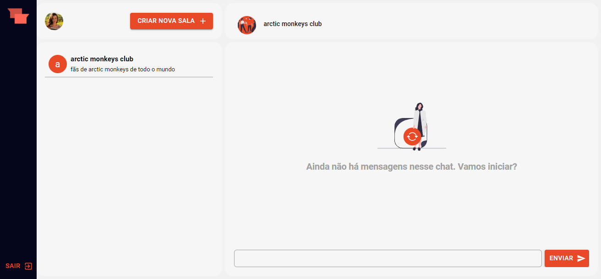
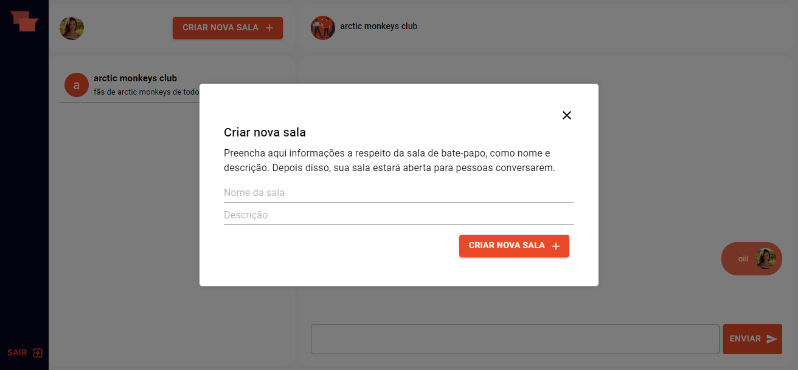

# Realtime chat application

Realtime application is a simple real-time chat application, where users can log in through their Google account to create and access different rooms, communicating in real-time.

## Login screen

## Empty state

## Create a new room

## Technologies
For the development of the interface, React.js framework was used along with styled-components and a bit of material-ui. To create the dynamics of rooms and messages, firestore database was used.

## Install on your machine
To have 100% access to the project's functionality, create a project on firestore and use the necessary project settings, as specified in our env.example.

After cloning the repository, make sure to navigate to the folder and install the necessary dependencies:

``npm i``

And start the project

``npm run dev``

## Next features
As an improvement, we can introduce new ways for users to register on the platform, as well as create private chat rooms and media sending.

## Contact
Feel free to suggest improvements :) send messages here or via my email: lysialeao@gmail.com